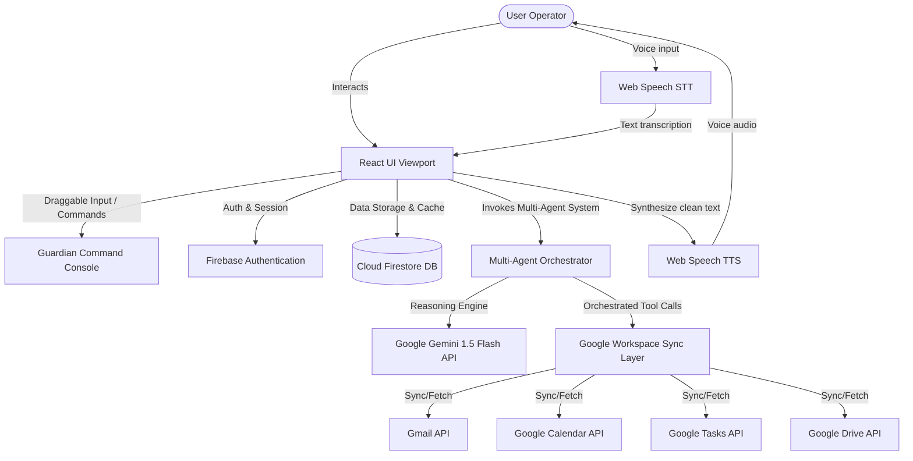

# Architecture Documentation - HellGuardian AI OS

This document details the software architecture, agent topology, and data flow pipelines of the HellGuardian AI Autonomous Productivity Operating System.

---

## 🏗️ System Overview

HellGuardian AI is built as a single-page application (SPA) on React, integrated with a serverless backend layer hosted on Firebase. It leverages Google Gemini AI models to orchestrate and automate user tasks across the Google Workspace API suite, coupled with local Voice Processing Engines.



---

## 🤖 Multi-Agent Orchestration Engine

The application does not use simple single-shot prompts. Instead, it utilizes a custom cooperative multi-agent system (`multiAgentEngine.ts`) where each agent has specialized task directives:

1.  **PLANNER AGENT:** Parses emails and calendar feeds to formulate the daily agenda.
2.  **SCHEDULER AGENT:** Inspects start/end bounds of appointments, flagging overlaps and suggesting deep-work focus windows.
3.  **RISK AGENT:** Calculates real-time burnout probability based on task deadlines, due dates, and required cognitive workload.
4.  **EMAIL AGENT:** Extracts critical deadlines from unread messages and formats them into high-priority task candidates.
5.  **RECOVERY AGENT:** Formulates contingency sprints and schedules when a user misses a deadline or enters **Focus Mode**.
6.  **COORDINATOR AGENT:** Synthesizes suggestions into actionable tool invocations.

---

## 🎙️ Speech Engine Architecture (STT & TTS)

The voice system processes conversations in three main steps:
1.  **Ingestion (Speech-to-Text):** The browser-native SpeechRecognition engine transcribes voice inputs.
2.  **Reasoning & Execution:** The transcription text triggers targeted workspace agent actions (Gmail summaries, Task creations, Schedule audits) or queries Gemini for conversational responses.
3.  **Synthesis (Text-to-Speech):** 
    *   The raw terminal response log is rendered visually.
    *   A markdown-cleaning parser (`cleanSpeechText`) strips delimiters (`===`), asterisks, prompt symbols (`>`), list symbols, and console labels.
    *   The cleaned string is synthesized via `SpeechSynthesisUtterance` for a clean conversational experience.

---

## 🔄 Data Synchronization Pipeline

When a user links their Google Account, a background synchronization routine is established to cache data and execute actions:

```mermaid
sequenceDiagram
    participant User
    participant App as React Application
    participant Agent as Multi-Agent Engine
    participant Cache as Firestore Cache
    participant Google as Google APIs
    
    User->{Voice command "Summarize emails"}->>App: Voice input captured
    App->>Google: Fetch Gmail Threads, Calendar, Tasks
    Google-->>App: Raw JSON Data payload
    App->>Cache: Update cache values (offline resiliency)
    App->>Agent: Send user request + context
    Agent->>Agent: Multi-agent planning & risk estimation
    Agent-->>App: Structured action recommendations
    App->>User: Display Plan & Speak cleaned vocal summary
```

---

## 🛡️ Database & Cache Schema

Firestore stores structured data under localized subcollections to support offline caching and query security:

*   `/users/{userId}`: Root user profile and state variables.
*   `/users/{userId}/tasks`: Cached tasks from Google Tasks, augmented with burnout risk index and duration.
*   `/users/{userId}/calendar_cache`: Cached Google Calendar appointments.
*   `/users/{userId}/gmail_cache`: Cached high-importance emails.
*   `/users/{userId}/drive_cache`: Document summaries and references.
