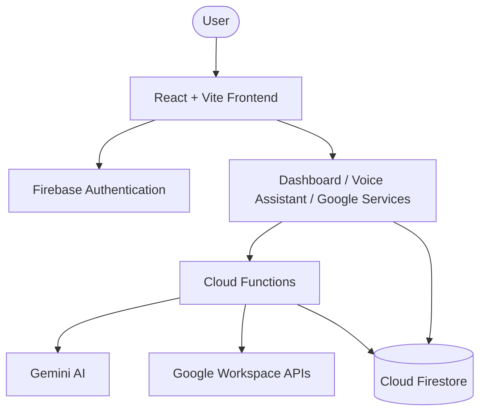

# 🛡️ HellGuardian AI

> Autonomous Productivity OS and Time Protector for the Google AI Hackathon.

---

## 📋 Project Overview

HellGuardian AI is an autonomous, agentic productivity operating system designed to shield users from timeline breaches, manage cognitive load, and optimize scheduling velocity. 

Traditional reminder apps require constant manual input and passive alarm dismissals. HellGuardian AI is different: it integrates directly with Google Workspace, uses Gemini AI for agentic decision-making, predicts burnout, detects task dependency bottlenecks, and features an interactive hands-free Voice Assistant and a terminal command console to actively keep you on track.

---

## 🚀 Live Demo & Links

*   **Live Demo**: [https://hellguardianai-9cf98.web.app](https://hellguardianai-9cf98.web.app)
*   **GitHub Repository**: [https://github.com/b-satwik/HellGuardianAI](https://github.com/b-satwik/HellGuardianAI)

---

## ✨ Key Features

### 🤖 AI Features
*   **Daily Planner**: Compiles optimal task lists and mission paths using workspace caches.
*   **Email Summarizer**: Scrapes latest Gmail threads and extracts core action items.
*   **Deadline Prediction**: Forecasts potential schedule slips based on active tasks and priority counts.
*   **Burnout Analysis**: Measures workload stress levels using task count and complexity factors.
*   **Task Prioritization**: Auto-assigns threat levels (Critical, High, Medium, Low) to tasks.

### 🔌 Google Workspace Integration
*   **Gmail**: Real-time email status logs and summaries.
*   **Calendar**: Interactive scheduler feed showing meeting conflicts and optimal slots.
*   **Tasks**: Actionable checklists showing risk scores and task dependencies.
*   **Drive**: Summarizes stored research documents and draft PDFs.
*   **People API**: Imports advisor and supervisor contacts for direct communication.

### 🎙️ Voice Features
*   **Speech Recognition**: Natural voice command input.
*   **Text-to-Speech**: Speech-synthesized audio feedback.
*   **Continuous Conversation**: Allows multi-turn continuous vocal dialogue.
*   **Voice Commands**: Hands-free triggers like `/focus`, `/status`, and `/plan`.

### 🖥️ Productivity Dashboard
*   **Focus Mode**: Complete visual lockdown screen that redirects focus to high-priority tasks.
*   **Analytics**: Metrics tracking task completion probability and energy expenditure.
*   **Terminal UI**: Draggable CLI console for power users with shortcut commands.
*   **Notifications**: Real-time status toasts for task injections and timeline breaches.

---

## 🛠️ Google Technologies Used

*   **Gemini AI**: Generates intelligence streams, summarizes workspace items, and manages tasks.
*   **Firebase Authentication**: Secures user workspace sessions and manages sign-ins.
*   **Cloud Firestore**: Document-based real-time database partitioning user caches.
*   **Cloud Functions**: Serverless HTTPS endpoints hosting proxy and background jobs.
*   **Firebase Hosting**: Delivers the low-latency dashboard frontend.
*   **Google Workspace APIs**: Integrated scopes for Gmail, Calendar, Tasks, Drive, and People.

---

## ⚙️ Technology Stack

| Layer | Technology |
| :--- | :--- |
| **Frontend** | React, Vite, TypeScript, Framer Motion, Lucide Icons, Tailwind CSS |
| **Backend** | Node.js, Firebase Cloud Functions (v2) |
| **Database** | Cloud Firestore |
| **AI** | Gemini 1.5 Flash |
| **Deployment** | Firebase Hosting & Cloud Functions |

---

## 📐 Architecture



---

## 📂 Repository Structure

```text
HellGuardianAI/
├── .firebase/           # Firebase Cache
├── dist/                # Frontend Build Output
├── functions/           # Firebase Cloud Functions (Backend)
│   ├── index.js         # Core Backend Logic (geminiProxy, dailyPlanner, etc.)
│   └── package.json
├── src/                 # React Frontend
│   ├── components/      # UI Components (VoiceAssistant, Analytics, CLI)
│   ├── config/          # Configurations (env.config.ts)
│   ├── context/         # AuthContext.tsx
│   ├── firebase/        # config.ts
│   ├── pages/           # DashboardPage.tsx, LoginPage.tsx
│   ├── services/        # geminiService.ts, googleServices.ts
│   └── main.tsx
├── package.json
├── firestore.rules
└── README.md
```

---

## ⚡ Installation & Deployment

### 1. Clone the Repository
```bash
git clone https://github.com/b-satwik/HellGuardianAI.git
cd HellGuardianAI
```

### 2. Configure Environment Variables
Create a `.env` file in the root directory:
```env
VITE_GEMINI_PROXY_URL=https://your-gemini-proxy-url-here
VITE_OAUTH_CLIENT_ID=YOUR_GOOGLE_OAUTH_CLIENT_ID
VITE_FIREBASE_API_KEY=YOUR_FIREBASE_API_KEY
VITE_FIREBASE_AUTH_DOMAIN=your-app.firebaseapp.com
VITE_FIREBASE_PROJECT_ID=your-project-id
VITE_FIREBASE_STORAGE_BUCKET=your-app.appspot.com
VITE_FIREBASE_MESSAGING_SENDER_ID=sender-id
VITE_FIREBASE_APP_ID=app-id
VITE_FIREBASE_MEASUREMENT_ID=measurement-id
```

### 3. Install Dependencies
```bash
# Frontend
npm install

# Backend
cd functions
npm install
cd ..
```

### 4. Run Locally
```bash
npm run dev
```

### 5. Deploy to Firebase
```bash
firebase deploy
```

---

## 📖 Documentation

*   [System Architecture](Architecture.md) — Technical specs, modules, and data flow.
*   [API Documentation](API_Documentation.md) — Endpoint inputs, outputs, and JSON payloads.
*   [Installation Guide](Installation.md) — Detailed setup, secrets, and Cloud Function setup.
*   [User Guide](UserGuide.md) — Detailed user workflows and command indices.

---

## 🔒 Security

*   **Firebase Authentication**: Secures sign-in and limits Firestore queries.
*   **Firestore Rules**: Scopes database read/writes to `users/{uid}/` to prevent cross-user leakage.
*   **Backend Gemini Proxy**: Routes LLM calls via Cloud Functions, keeping API keys safe.
*   **Environment Variables**: Sensitive values are kept in environment variables rather than code.
*   **Google OAuth Scopes**: Scopes Google token authorization to read-only access.

---

## 📄 License

This project is licensed under the Apache 2.0 License - see the [LICENSE](LICENSE) file for details.

---

Built for Google AI Hackathon 2026 by Bala Satwik.
